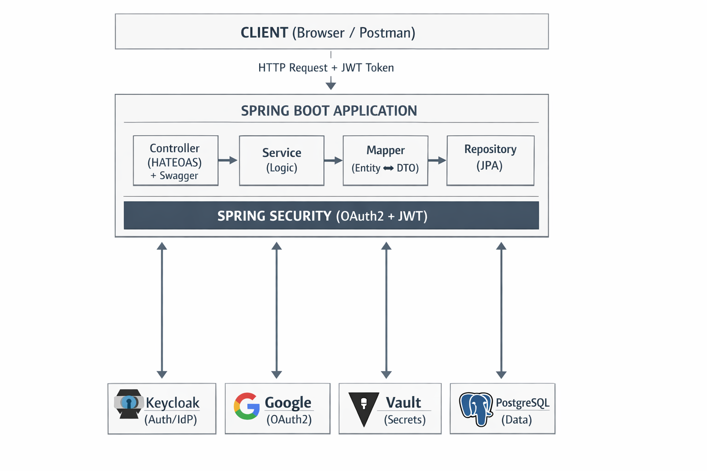
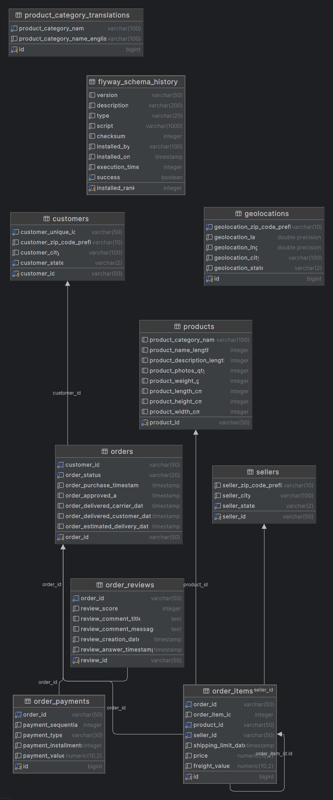

# 🛒 Olist E-Commerce API

API REST **Level 3 (HATEOAS)** para gerenciamento de dados de e-commerce da Olist, construída com **Kotlin 2.3.0**, **Spring Boot 4.0.5** e **Java 25**.

Projeto com autenticação **OAuth2** via **Keycloak** (com suporte a login social Google), gerenciamento de secrets com **HashiCorp Vault**, versionamento de banco com **Flyway**, banco de dados **PostgreSQL**, documentação interativa **Swagger UI** com autenticação integrada e suite de testes com **H2** em memória.

---

## 📐 Arquitetura



### Camadas da Aplicação

| Camada | Responsabilidade |
|--------|-----------------|
| **Controller** | Endpoints REST com HATEOAS links, documentação Swagger (`@Tag`, `@Operation`, `@ApiResponse`), validação de entrada |
| **Service** | Lógica de negócio, transações (`@Transactional`), regras de domínio |
| **Mapper** | Conversão entre Entity ↔ DTO (Request/Response), desacoplamento de camadas |
| **Repository** | Acesso a dados via Spring Data JPA com queries derivadas |
| **Entity** | Mapeamento ORM das tabelas do banco com JPA/Hibernate |
| **DTO** | Payloads de Request (com Bean Validation) e Response (com `RepresentationModel` HATEOAS) |
| **Config** | Segurança (`SecurityConfig`), CORS (`WebConfig`), OpenAPI (`OpenApiConfig`) |
| **Exception** | Tratamento global de erros com `@RestControllerAdvice` e respostas padronizadas |

---

## 🚀 Tecnologias

| Tecnologia | Versão | Descrição |
|-----------|--------|-----------|
| **Kotlin** | 2.3.0 | Linguagem principal |
| **Java** | 25 | JDK / Toolchain |
| **Spring Boot** | 4.0.5 | Framework principal |
| **Spring Cloud** | 2025.1.1 | Cloud integrations (Vault) |
| **Spring Security** | — | Autenticação e autorização OAuth2 + JWT |
| **Spring HATEOAS** | — | REST Level 3 com hypermedia links |
| **Spring Data JPA** | — | Persistência com Hibernate |
| **Flyway** | — | Versionamento e migração de banco |
| **SpringDoc OpenAPI** | 3.0.2 | Documentação Swagger UI com OAuth2 integrado |
| **PostgreSQL** | 16 | Banco de dados relacional (produção) |
| **H2** | — | Banco de dados em memória (testes) |
| **Keycloak** | 24.0 | Identity Provider (OAuth2/OIDC) |
| **HashiCorp Vault** | 1.17 | Gerenciamento de secrets |
| **Docker** | — | Containerização (multi-stage build) |
| **Gradle** | 9.4.1 | Build tool |
| **JUnit 5** | — | Framework de testes |
| **Mockito Kotlin** | 5.4.0 | Mocking para testes unitários |

---

## 📁 Estrutura do Projeto

```
src/main/kotlin/br/com/springbootkeycloakoauth2/
├── config/
│   ├── OpenApiConfig.kt          # Swagger/OpenAPI com OAuth2 Keycloak + Bearer JWT
│   ├── SecurityConfig.kt         # Spring Security + OAuth2 Resource Server + JWT
│   └── WebConfig.kt              # CORS
├── controller/
│   ├── CustomerController.kt     # CRUD Customers (HATEOAS + Swagger)
│   ├── OrderController.kt        # CRUD Orders (HATEOAS + Swagger)
│   ├── ProductController.kt      # CRUD Products (HATEOAS + Swagger)
│   └── SellerController.kt       # CRUD Sellers (HATEOAS + Swagger)
├── dto/
│   ├── request/
│   │   ├── CustomerRequest.kt    # Validações: @NotBlank, @Size
│   │   ├── OrderRequest.kt       # Validações: @NotBlank, @Size
│   │   ├── ProductRequest.kt     # Validações: @Min, @Size
│   │   └── SellerRequest.kt      # Validações: @NotBlank, @Size
│   └── response/
│       ├── CustomerResponse.kt   # RepresentationModel (HATEOAS)
│       ├── OrderResponse.kt      # RepresentationModel (HATEOAS)
│       ├── OrderReviewResponse.kt
│       ├── ProductResponse.kt    # RepresentationModel (HATEOAS)
│       └── SellerResponse.kt     # RepresentationModel (HATEOAS)
├── entity/
│   ├── Customer.kt
│   ├── Geolocation.kt
│   ├── Order.kt
│   ├── OrderItem.kt
│   ├── OrderPayment.kt
│   ├── OrderReview.kt
│   ├── Product.kt
│   ├── ProductCategoryTranslation.kt
│   └── Seller.kt
├── exception/
│   ├── GlobalExceptionHandler.kt # @RestControllerAdvice
│   └── ResourceNotFoundException.kt
├── mapper/
│   ├── CustomerMapper.kt         # Customer Entity ↔ DTO
│   ├── OrderMapper.kt            # Order Entity ↔ DTO
│   ├── ProductMapper.kt          # Product Entity ↔ DTO
│   └── SellerMapper.kt           # Seller Entity ↔ DTO
├── repository/
│   ├── CustomerRepository.kt     # findByCustomerState, findByCustomerCity
│   ├── OrderRepository.kt        # findByCustomerCustomerId, findByOrderStatus
│   ├── OrderReviewRepository.kt  # findByOrderOrderId
│   ├── ProductRepository.kt      # findByProductCategoryName
│   └── SellerRepository.kt       # findBySellerState
├── service/
│   ├── CustomerService.kt        # CRUD + busca por estado
│   ├── OrderService.kt           # CRUD + busca por cliente/status + updateStatus
│   ├── ProductService.kt         # CRUD + busca por categoria
│   └── SellerService.kt          # CRUD + busca por estado
└── SpringBootKeycloakOauth2Application.kt

src/main/resources/
├── db/migration/
│   ├── structure/
│   │   └── V1__create_tables.sql # DDL - Criação das tabelas, constraints e índices
│   └── data/
│       └── V2__load_csv_data.sql # DML - Carga dos CSVs via COPY (apenas Docker)
└── application.yml               # Configurações (datasource, security, vault, swagger)

src/test/kotlin/br/com/springbootkeycloakoauth2/
├── config/
│   └── TestSecurityConfig.kt     # SecurityConfig de teste com JwtDecoder mockado
├── controller/
│   ├── CustomerControllerTest.kt # Testes de integração (MockMvc + JWT)
│   └── OrderControllerTest.kt    # Testes de integração (MockMvc + JWT)
├── service/
│   ├── CustomerServiceTest.kt    # Testes unitários (Mockito)
│   ├── OrderServiceTest.kt       # Testes unitários (Mockito)
│   ├── ProductServiceTest.kt     # Testes unitários (Mockito)
│   └── SellerServiceTest.kt      # Testes unitários (Mockito)
└── SpringBootKeycloakOauth2ApplicationTests.kt  # Context loads

src/test/resources/
└── application-test.yml          # H2 em memória, Flyway off, Vault off
```

---

## 🔐 Segurança

### Fluxo de Autenticação

```
┌────────┐         ┌──────────┐         ┌──────────────┐
│ Client │──(1)──▶│ Keycloak │◀──(2)──▶│    Google    │
│        │◀──(3)──│  /token  │         │   (Social)   │
└───┬────┘         └──────────┘         └──────────────┘
    │ (4) JWT Token
    ▼
┌──────────────────┐
│  Spring Boot API │  → Valida JWT → Extrai roles → Autoriza
└──────────────────┘
```

1. Client solicita autenticação ao Keycloak
2. Keycloak pode delegar ao Google (Social Login)
3. Keycloak retorna JWT (access_token)
4. Client envia JWT no header `Authorization: Bearer <token>`

### Extração de Roles do JWT

O `SecurityConfig` usa um `KeycloakRealmRoleConverter` que extrai as roles do claim `realm_access.roles` do JWT e converte para `ROLE_ADMIN`, `ROLE_USER` do Spring Security.

### Roles e Permissões

| Role | GET | POST | PUT | PATCH | DELETE |
|------|-----|------|-----|-------|--------|
| **ADMIN** | ✅ | ✅ | ✅ | ✅ | ✅ |
| **USER** | ✅ | ❌ | ❌ | ❌ | ❌ |

### HashiCorp Vault

Secrets gerenciados pelo Vault (path: `secret/keycloak-oauth`):
- `spring.datasource.username`
- `spring.datasource.password`
- `spring.security.oauth2.client.registration.keycloak.client-id`
- `spring.security.oauth2.client.registration.keycloak.client-secret`
- `spring.security.oauth2.client.registration.google.client-id`
- `spring.security.oauth2.client.registration.google.client-secret`

---

## 📖 Swagger UI (OpenAPI)

### Acesso

| URL | Descrição |
|-----|-----------|
| `http://localhost:9090/swagger-ui.html` | Interface interativa |
| `http://localhost:9090/v3/api-docs` | Especificação OpenAPI JSON |

### Autenticação no Swagger

Clique em **Authorize** 🔒 → será redirecionado ao Keycloak → faça login com **admin/admin** (ou **user/user** para leitura) ou clique em **Login com Google** → o token JWT é injetado automaticamente em todas as requisições.

O `client-id` e `client-secret` são preenchidos automaticamente via `application.yml`.

As URLs de autorização e token do Swagger são configuráveis via variáveis de ambiente (`SWAGGER_OAUTH2_AUTH_URL`, `SWAGGER_OAUTH2_TOKEN_URL`) e sempre apontam para `localhost` (acessível pelo browser), independente de rodar local ou via Docker.

### Documentação dos Endpoints

Cada endpoint possui:
- `@Tag` — Agrupamento por recurso (Customers, Orders, Products, Sellers)
- `@Operation` — Descrição do endpoint com `summary` e `description`
- `@ApiResponse` — Códigos de resposta documentados (200, 201, 400, 401, 403, 404)
- `@Parameter` — Descrição dos parâmetros de entrada

---

## 🗄️ Banco de Dados

### Modelo de Dados (Olist Dataset)



### Flyway Migrations

As migrations são separadas em dois diretórios para suportar execução local e Docker:

| Diretório | Versão | Arquivo | Descrição | Quando roda |
|-----------|--------|---------|-----------|-------------|
| `structure/` | V1 | `V1__create_tables.sql` | Criação de tabelas, constraints e índices | Sempre (local + Docker) |
| `data/` | V2 | `V2__load_csv_data.sql` | Carga dos CSVs via `COPY` do PostgreSQL | Apenas Docker |

- **Local**: Flyway roda apenas `classpath:db/migration/structure` — tabelas criadas vazias, dados populados via API
- **Docker**: Flyway roda `classpath:db/migration/structure,classpath:db/migration/data` — tabelas criadas e dados carregados dos CSVs automaticamente

---

## 🌐 API Endpoints

### Auth `/api/auth`

| Método | Endpoint | Descrição | Role |
|--------|----------|-----------|------|
| POST | `/api/auth/token` | Obter token com usuário e senha | Público |
| POST | `/api/auth/refresh` | Renovar token com refresh_token | Público |

### Customers `/api/v1/customers`

| Método | Endpoint | Descrição | Role |
|--------|----------|-----------|------|
| GET | `/api/v1/customers` | Listar todos (paginado) | ADMIN, USER |
| GET | `/api/v1/customers/{id}` | Buscar por ID | ADMIN, USER |
| GET | `/api/v1/customers/state/{state}` | Buscar por estado | ADMIN, USER |
| POST | `/api/v1/customers` | Criar novo | ADMIN |
| PUT | `/api/v1/customers/{id}` | Atualizar | ADMIN |
| DELETE | `/api/v1/customers/{id}` | Deletar | ADMIN |

### Orders `/api/v1/orders`

| Método | Endpoint | Descrição | Role |
|--------|----------|-----------|------|
| GET | `/api/v1/orders` | Listar todos (paginado) | ADMIN, USER |
| GET | `/api/v1/orders/{id}` | Buscar por ID | ADMIN, USER |
| GET | `/api/v1/orders/customer/{customerId}` | Buscar por cliente | ADMIN, USER |
| GET | `/api/v1/orders/status/{status}` | Buscar por status | ADMIN, USER |
| POST | `/api/v1/orders` | Criar novo | ADMIN |
| PATCH | `/api/v1/orders/{id}/status?status=` | Atualizar status | ADMIN |

### Products `/api/v1/products`

| Método | Endpoint | Descrição | Role |
|--------|----------|-----------|------|
| GET | `/api/v1/products` | Listar todos (paginado) | ADMIN, USER |
| GET | `/api/v1/products/{id}` | Buscar por ID | ADMIN, USER |
| GET | `/api/v1/products/category/{name}` | Buscar por categoria | ADMIN, USER |
| POST | `/api/v1/products` | Criar novo | ADMIN |
| PUT | `/api/v1/products/{id}` | Atualizar | ADMIN |
| DELETE | `/api/v1/products/{id}` | Deletar | ADMIN |

### Sellers `/api/v1/sellers`

| Método | Endpoint | Descrição | Role |
|--------|----------|-----------|------|
| GET | `/api/v1/sellers` | Listar todos (paginado) | ADMIN, USER |
| GET | `/api/v1/sellers/{id}` | Buscar por ID | ADMIN, USER |
| GET | `/api/v1/sellers/state/{state}` | Buscar por estado | ADMIN, USER |
| POST | `/api/v1/sellers` | Criar novo | ADMIN |
| PUT | `/api/v1/sellers/{id}` | Atualizar | ADMIN |
| DELETE | `/api/v1/sellers/{id}` | Deletar | ADMIN |

### Exemplo de Response HATEOAS

```json
{
  "customerId": "abc123",
  "customerUniqueId": "unique456",
  "customerZipCodePrefix": "01001",
  "customerCity": "São Paulo",
  "customerState": "SP",
  "_links": {
    "self": {
      "href": "http://localhost:9090/api/v1/customers/abc123"
    },
    "customers": {
      "href": "http://localhost:9090/api/v1/customers"
    },
    "orders": {
      "href": "http://localhost:9090/api/v1/orders/customer/abc123"
    }
  }
}
```

---

## 🧪 Testes

### Estratégia de Testes

| Tipo | Tecnologia | Descrição |
|------|-----------|-----------|
| **Unitários (Service)** | JUnit 5 + Mockito Kotlin | Testam lógica de negócio isolada com mocks dos repositories e mappers |
| **Integração (Controller)** | SpringBootTest + MockMvc | Testam endpoints HTTP com contexto Spring, H2 e segurança JWT mockada |
| **Context Load** | SpringBootTest | Valida que o contexto Spring sobe corretamente |

### Configuração de Testes

- **Banco**: H2 em memória (`application-test.yml`)
- **Profile**: `test` — ativa `TestSecurityConfig` com `JwtDecoder` mockado
- **Flyway**: desabilitado (JPA `create-drop`)
- **Vault**: desabilitado
- **OAuth2 Auto-Config**: excluída (sem dependência de Keycloak real)
- **Segurança**: `TestSecurityConfig` com mesmas regras de autorização, mas sem issuer-uri externo

### Cobertura

| Classe | Testes | O que testa |
|--------|--------|-------------|
| `CustomerServiceTest` | 7 | findAll, findById, create, update, delete, exceções |
| `OrderServiceTest` | 7 | findAll, findById, create, updateStatus, exceções |
| `ProductServiceTest` | 5 | findAll, findById, create, delete, exceções |
| `SellerServiceTest` | 6 | findAll, findById, create, delete, exceções |
| `CustomerControllerTest` | 4 | GET por ID (ADMIN/USER), GET lista, 401 sem token |
| `OrderControllerTest` | 4 | GET por ID (ADMIN/USER), GET lista, 401 sem token |
| `ApplicationTests` | 1 | Context loads |
| **Total** | **34** | |

### Executar Testes

```bash
# Todos os testes
./gradlew test

# Apenas testes unitários dos services
./gradlew test --tests "*ServiceTest"

# Apenas testes de integração dos controllers
./gradlew test --tests "*ControllerTest"
```

---

## 🐳 Docker

### Serviços

| Serviço | Imagem | Porta | Descrição |
|---------|--------|-------|-----------|
| **postgres-app** | postgres:16 | 5432 | Banco da aplicação (com CSVs montados em `/data`) |
| **postgres-keycloak** | postgres:16 | 5433 | Banco do Keycloak |
| **keycloak** | keycloak:24.0 | 8080 | Identity Provider (realm importado automaticamente) |
| **vault** | vault:1.17 | 8200 | Gerenciamento de secrets (inicializado via script) |
| **app** | Dockerfile | 9090 | API Spring Boot |

### Dockerfile (Multi-stage)

```dockerfile
# Stage 1: Build com JDK 25
FROM eclipse-temurin:25-jdk AS build
# Compila o projeto com Gradle (sem testes)

# Stage 2: Runtime com JRE 25
FROM eclipse-temurin:25-jre
# Executa apenas o JAR otimizado
```

---

## ⚡ Como Executar

### Pré-requisitos

- Docker e Docker Compose
- Java 25 (para desenvolvimento local)

### 1. Via Docker (recomendado)

```bash
docker-compose up -d
```

Isso irá iniciar:
- PostgreSQL (app + keycloak)
- Keycloak (com realm `olist-realm` importado automaticamente)
- Vault (com secrets inicializados via `vault/init-secrets.sh`)
- Aplicação Spring Boot (com dados CSV carregados automaticamente)

### 2. Configurar Google OAuth2 (Social Login)

> **Importante**: O Keycloak não suporta variáveis de ambiente no `realm-export.json`. O realm é importado com placeholders para o Google Identity Provider, por isso a configuração do Google deve ser feita **manualmente** após o primeiro `docker-compose up`.

1. Acesse o **Keycloak Admin Console**: http://localhost:8080
2. Faça login com `admin` / `admin`
3. Selecione o realm **olist-realm** (dropdown no canto superior esquerdo)
4. No menu lateral, clique em **Identity Providers** → **google**
5. Preencha os campos:
   - **Client ID** → valor de `GOOGLE_CLIENT_ID` do arquivo `.env`
   - **Client Secret** → valor de `GOOGLE_CLIENT_SECRET` do arquivo `.env`
6. Clique em **Save**

> **Pré-requisito Google**: No [Google Cloud Console](https://console.cloud.google.com/apis/credentials), o OAuth 2.0 Client deve ter:
> - **Authorized redirect URIs**: `http://localhost:8080/realms/olist-realm/broker/google/endpoint`
> - **Authorized JavaScript origins**: `http://localhost:8080`

Após essa configuração, o botão **Login com Google** aparecerá na tela de login do Keycloak (Swagger e Postman).

> **Nota**: A autenticação por **usuário/senha** (admin/admin, user/user) funciona imediatamente sem nenhuma configuração adicional.

### 3. Via Local (desenvolvimento)

```bash
# Subir apenas infraestrutura
docker-compose up -d postgres-app postgres-keycloak keycloak vault

# Rodar a aplicação
./gradlew bootRun
```

> **Nota**: Localmente, apenas as tabelas são criadas (V1). Os dados CSV não são carregados (V2 usa `COPY` server-side do PostgreSQL). Popule via API ou Swagger UI.

### 4. Acessar os serviços

| Serviço | URL |
|---------|-----|
| **API** | http://localhost:9090 |
| **Swagger UI** | http://localhost:9090/swagger-ui.html |
| **Keycloak Admin** | http://localhost:8080 |
| **Vault UI** | http://localhost:8200 |

### 5. Obter token de acesso

```bash
# Via API (usuário admin — role ADMIN)
curl -X POST http://localhost:9090/api/auth/token \
  -d "username=admin" \
  -d "password=admin"

# Via API (usuário user — role USER, apenas leitura)
curl -X POST http://localhost:9090/api/auth/token \
  -d "username=user" \
  -d "password=user"

# Renovar token com refresh_token
curl -X POST http://localhost:9090/api/auth/refresh \
  -d "refresh_token=<REFRESH_TOKEN>"
```

Ou via Keycloak diretamente:

```bash
curl -X POST http://localhost:8080/realms/olist-realm/protocol/openid-connect/token \
  -H "Content-Type: application/x-www-form-urlencoded" \
  -d "grant_type=password" \
  -d "client_id=olist-client" \
  -d "client_secret=olist-client-secret" \
  -d "username=admin" \
  -d "password=admin"
```

### 6. Chamar a API

```bash
curl -H "Authorization: Bearer <TOKEN>" \
  http://localhost:9090/api/v1/customers?page=0&size=10
```

### 7. Ou usar o Swagger UI

Acesse `http://localhost:9090/swagger-ui.html` → clique em **Authorize** 🔒 → autentique via OAuth2 Keycloak → teste os endpoints diretamente na interface.

---

## 🔧 Variáveis de Ambiente

Todas as variáveis estão no arquivo `.env`:

| Variável | Descrição | Valor Padrão |
|----------|-----------|--------------|
| `DB_NAME` | Nome do banco da aplicação | olist_db |
| `DB_USERNAME` | Usuário do banco | olist_user |
| `DB_PASSWORD` | Senha do banco | olist_pass |
| `DB_PORT` | Porta do PostgreSQL | 5432 |
| `KEYCLOAK_ADMIN` | Admin do Keycloak | admin |
| `KEYCLOAK_ADMIN_PASSWORD` | Senha admin Keycloak | admin |
| `KEYCLOAK_PORT` | Porta do Keycloak | 8080 |
| `KEYCLOAK_CLIENT_ID` | Client ID OAuth2 | olist-client |
| `KEYCLOAK_CLIENT_SECRET` | Client Secret OAuth2 | olist-client-secret |
| `KEYCLOAK_REALM` | Realm do Keycloak | olist-realm |
| `KEYCLOAK_ISSUER_URI` | Issuer URI do Keycloak | http://localhost:8080/realms/olist-realm |
| `GOOGLE_CLIENT_ID` | Google OAuth2 Client ID | — |
| `GOOGLE_CLIENT_SECRET` | Google OAuth2 Client Secret | — |
| `SWAGGER_OAUTH2_AUTH_URL` | URL de autorização OAuth2 para Swagger | http://localhost:8080/realms/olist-realm/protocol/openid-connect/auth |
| `SWAGGER_OAUTH2_TOKEN_URL` | URL de token OAuth2 para Swagger | http://localhost:8080/realms/olist-realm/protocol/openid-connect/token |
| `APP_PORT` | Porta da aplicação | 9090 |
| `VAULT_TOKEN` | Token root do Vault | vault-root-token |
| `VAULT_PORT` | Porta do Vault | 8200 |

---

## 📋 Validações dos Requests

Todos os endpoints de criação/atualização validam os payloads com Bean Validation:

| Campo | Validação |
|-------|-----------|
| `customerUniqueId` | `@NotBlank`, `@Size(max=50)` |
| `customerZipCodePrefix` | `@NotBlank`, `@Size(max=10)` |
| `customerCity` | `@NotBlank`, `@Size(max=100)` |
| `customerState` | `@NotBlank`, `@Size(min=2, max=2)` |
| `productWeightG` | `@Min(0)` |
| `productCategoryName` | `@Size(max=100)` |
| `sellerCity` | `@NotBlank`, `@Size(max=100)` |
| `sellerState` | `@NotBlank`, `@Size(min=2, max=2)` |
| `orderStatus` | `@NotBlank`, `@Size(max=20)` |
| `orderId (customerId)` | `@NotBlank`, `@Size(max=50)` |

Erros de validação retornam HTTP 400 com detalhes:

```json
{
  "timestamp": "2025-01-15T10:30:00",
  "status": 400,
  "error": "Validation Failed",
  "message": "Request validation failed",
  "details": {
    "customerState": "State must be exactly 2 characters",
    "customerCity": "City is required"
  }
}
```

---

## ☁️ Terraform (Multi-Cloud)

Infra como código para deploy em **AWS**, **Azure** e **GCP**.

### Estrutura

```
terraform/
├── .gitignore
├── aws/
│   ├── main.tf                  # Provider + backend S3
│   ├── variables.tf             # Variáveis
│   ├── vpc.tf                   # VPC, subnets, NAT, IGW
│   ├── eks.tf                   # EKS cluster + node group
│   ├── rds.tf                   # RDS PostgreSQL (app + keycloak)
│   ├── ecr.tf                   # ECR container registry
│   ├── security-groups.tf       # SG para RDS
│   ├── outputs.tf
│   └── terraform.tfvars.example
├── azure/
│   ├── main.tf                  # Provider + backend Azure Storage
│   ├── variables.tf             # Variáveis
│   ├── vnet.tf                  # VNet, subnets, DNS privado
│   ├── aks.tf                   # AKS cluster + ACR pull
│   ├── postgres.tf              # PostgreSQL Flexible Server
│   ├── acr.tf                   # Azure Container Registry
│   ├── outputs.tf
│   └── terraform.tfvars.example
└── gcp/
    ├── main.tf                  # Provider + backend GCS + APIs
    ├── variables.tf             # Variáveis
    ├── vpc.tf                   # VPC, subnet, NAT, peering
    ├── gke.tf                   # GKE cluster + node pool
    ├── cloudsql.tf              # Cloud SQL PostgreSQL
    ├── artifact-registry.tf     # Artifact Registry
    ├── outputs.tf
    └── terraform.tfvars.example
```

### Recursos por Cloud

| Recurso | AWS | Azure | GCP |
|---------|-----|-------|-----|
| **Rede** | VPC + Subnets + NAT | VNet + Subnets + DNS | VPC + Subnet + NAT |
| **Kubernetes** | EKS | AKS | GKE |
| **Banco de Dados** | RDS PostgreSQL 16 | Flexible Server 16 | Cloud SQL PostgreSQL 16 |
| **Container Registry** | ECR | ACR | Artifact Registry |
| **Auto-scaling** | EKS Node Group (1–4) | AKS Node Pool (1–4) | GKE Node Pool (1–4) |

### Como usar

```bash
# Escolha a cloud (aws, azure ou gcp)
cd terraform/aws

# Copie e edite as variáveis
cp terraform.tfvars.example terraform.tfvars
# Edite terraform.tfvars com suas credenciais

# Inicialize e aplique
terraform init
terraform plan
terraform apply

# Configure kubectl (output do terraform)
aws eks update-kubeconfig --name olist-eks --region us-east-1

# Deploy dos manifests K8s
cd ../../k8s
./deploy.sh
```

---

## ☸️ Kubernetes

### Arquitetura K8s

```
┌─────────────────────────────────────────────────────────────────┐
│                    Kubernetes Cluster (namespace: olist)          │
│                                                                   │
│  ┌───────────────┐  ┌───────────────┐  ┌───────────────┐    │
│  │   Ingress     │  │   olist-api   │  │   olist-api   │    │
│  │  (nginx)      │─▶│  Pod 1 (HPA)  │  │  Pod 2 (HPA)  │    │
│  └───────────────┘  └───────┬───────┘  └───────┬───────┘    │
│                         │                   │                  │
│              ┌─────────┴───────────────┴─────────┐      │
│              │                                   │      │
│  ┌───────────┴───┐  ┌───────────────┐  ┌───┴───────────┐  │
│  │ postgres-app  │  │   keycloak    │  │    vault      │  │
│  │   (PVC 5Gi)   │  │              │  │              │  │
│  └───────────────┘  └───────┬───────┘  └───────────────┘  │
│                         │                                │
│                 ┌───────┴─────────────┐                │
│                 │ postgres-keycloak  │                │
│                 │    (PVC 2Gi)       │                │
│                 └─────────────────────┘                │
└─────────────────────────────────────────────────────────────────┘
```

### Manifests

```
k8s/
├── 00-namespace.yaml          # Namespace "olist"
├── 01-secrets.yaml            # Secrets (senhas, tokens)
├── 02-configmap.yaml          # ConfigMap (nomes de bancos, realm)
├── 03-pvc.yaml                # PersistentVolumeClaims (5Gi app, 2Gi keycloak)
├── 04-postgres-app.yaml       # Deployment + Service PostgreSQL (app)
├── 05-postgres-keycloak.yaml  # Deployment + Service PostgreSQL (keycloak)
├── 06-vault.yaml              # Deployment + Service Vault
├── 07-vault-init-job.yaml     # Job para inicializar secrets no Vault
├── 08-keycloak.yaml           # Deployment + Service Keycloak
├── 09-olist-api.yaml          # Deployment + Service API (2 réplicas)
├── 10-hpa.yaml                # HorizontalPodAutoscaler (2–5 pods, CPU 70%)
├── 11-ingress.yaml            # Ingress (api.olist.local, auth.olist.local)
├── 12-network-policy.yaml     # NetworkPolicies (restrição de acesso)
├── deploy.sh                  # Script de deploy automático
└── destroy.sh                 # Script de remoção
```

### Recursos

| Recurso | Descrição |
|---------|-----------|
| **Namespace** | `olist` — isolamento de todos os recursos |
| **Secrets** | Senhas dos bancos, token do Vault, credenciais Keycloak |
| **ConfigMap** | Nomes dos bancos, realm, client ID |
| **PVC** | 5Gi para PostgreSQL app, 2Gi para PostgreSQL Keycloak |
| **HPA** | Auto-scaling da API: 2–5 pods (CPU 70%, Memória 80%) |
| **Ingress** | `api.olist.local` (API), `auth.olist.local` (Keycloak) |
| **NetworkPolicy** | PostgreSQL só aceita conexões da API/Keycloak, Vault só da API |

### Deploy

```bash
# Build da imagem Docker
docker build -t olist-api:latest .

# Deploy completo
cd k8s
chmod +x deploy.sh
./deploy.sh
```

### Acesso via port-forward

```bash
kubectl port-forward svc/olist-api 9090:9090 -n olist
kubectl port-forward svc/keycloak 8080:8080 -n olist
kubectl port-forward svc/vault 8200:8200 -n olist
```

### Acesso via Ingress

Adicione ao `/etc/hosts` (ou `C:\Windows\System32\drivers\etc\hosts`):

```
127.0.0.1 api.olist.local auth.olist.local
```

| Serviço | URL |
|---------|-----|
| **API / Swagger** | http://api.olist.local |
| **Keycloak** | http://auth.olist.local |

### Remover

```bash
cd k8s
chmod +x destroy.sh
./destroy.sh
```

---

## ⏱️ Rate Limiting

A API implementa rate limiting por IP usando Token Bucket:

| Configuração | Valor Padrão |
|-------------|-------------|
| Requisições por minuto | 60 |
| Escopo | Apenas `/api/**` |
| Identificação | IP do cliente (`X-Forwarded-For` ou `remoteAddr`) |

Headers de resposta:

| Header | Descrição |
|--------|-----------|
| `X-RateLimit-Limit` | Limite máximo por minuto |
| `X-RateLimit-Remaining` | Requisições restantes |
| `Retry-After` | Segundos para aguardar (quando 429) |

Quando excede o limite, retorna HTTP 429:

```json
{
  "status": 429,
  "error": "Too Many Requests",
  "message": "Rate limit exceeded. Try again in 60 seconds."
}
```

Configurável via `application.yml`:

```yaml
rate-limit:
  requests-per-minute: 60
```

---

